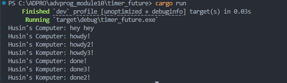
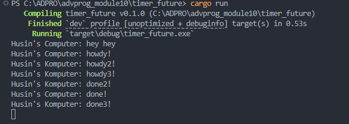

# Experiment 1.2: Understanding how it works


## Modifikasi dan Penjelasan

Mari kita pertimbangkan apa yang terjadi jika kita menambahkan sebuah kalimat cetak baru tepat setelah `spawner.spawn(...)` di `main.rs`, misalnya:

```rust
// ...
    spawner.spawn(async {
        println!("Husin's Computer: howdy!");
        TimerFuture::new(Duration::new(2, 0)).await;
        println!("Husin's Computer: done!");
    });

    println!("Husin's Computer: hey hey");
// ...
```

### Penjelasan Hasil Output:

Meskipun pemanggilan `println!("Husin's Computer: hey hey");` dilakukan setelah pemanggilan `spawner.spawn(async { ... });`, string `"hey hey"` dicetak sebelum `"howdy!"`.

Perilaku ini terjadi karena fungsi asynchronous (`async`) beroperasi secara independen dari alur eksekusi utama. Akibatnya, program utama tidak menunggu selesainya fungsi asynchronous sebelum melanjutkan eksekusinya.

Pernyataan `println!("Husin's Computer: hey hey");` diposisikan di luar fungsi asynchronous dan segera dieksekusi oleh program utama. Sementara itu, fungsi asynchronous mungkin sedang menunggu hasil dari *future* (dalam kasus ini, `TimerFuture`) atau menunggu untuk diambil dan dijalankan oleh executor.

Sebagai hasilnya, pesan dari thread utama dicetak terlebih dahulu, diikuti oleh eksekusi tugas asynchronous yang dikelola oleh executor, yang kemudian mencetak `"howdy!"` dan akhirnya `"done!"` setelah timer selesai. 


# Experiment 1.3: Multiple Spawn 


## Perbandingan: Dengan dan Tanpa `drop(spawner);`

### 1. Dengan `drop(spawner);`



### 2. Tanpa `drop(spawner);`



### Penjelasan Perbedaan Output

Ketika `drop(spawner);` dipanggil sebelum `executor.run();`, channel untuk mengirim task ke executor akan ditutup. Hal ini memberi sinyal kepada executor bahwa tidak akan ada task baru yang dikirim, sehingga executor akan berhenti setelah semua task yang ada di antrian selesai dijalankan. Hasilnya, program akan selesai dengan rapi setelah semua task async selesai.

Sebaliknya, jika `drop(spawner);` tidak dipanggil, channel task masih terbuka. Executor akan terus menunggu kemungkinan adanya task baru yang dikirim ke channel, sehingga program tidak akan pernah selesai (hang/menunggu terus) meskipun semua task yang sudah di-spawn telah selesai dijalankan. Inilah mengapa pada gambar tanpa `drop(spawner);`, program tampak tidak pernah selesai dan menunggu di konsol.

**Kesimpulan:**
- `drop(spawner);` penting untuk memberi tahu executor bahwa tidak ada lagi task yang akan dikirim, sehingga program bisa berhenti dengan benar setelah semua task selesai.
- Tanpa `drop(spawner);`, executor tidak tahu kapan harus berhenti dan program akan terus berjalan menunggu task baru yang tidak pernah datang.
